  

# Hi, I'm Idan

I'm a student and full-stack developer from Israel. Down to code.

## Currently

- Surviving school
- Learning Rust and Go
- Creating a website for my driving instructor

## Languages and tools

### Main stack

### Exploring

### Tools and platforms

## Contact

- Website: [w0x7y.github.io](https://w0x7y.github.io)
- Email: [idangilb@gmail.com](mailto:idangilb@gmail.com)
